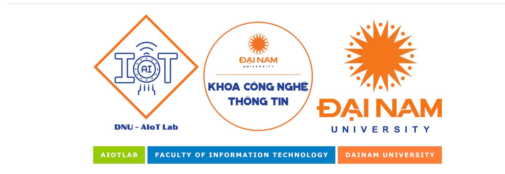
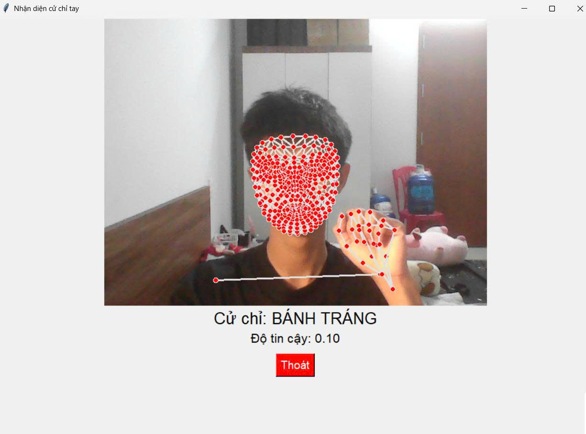

# 🎓 NHẬN DIỆN CỬ CHỈ HỖ TRỢ NGƯỜI KHUYẾT TẬT  

--- 

### 🔬 Ứng dụng trí tuệ nhân tạo trong giao tiếp hỗ trợ người khuyết tật thông qua nhận dạng cử chỉ 

**Hệ thống nhận diện ngôn ngữ ký hiệu tiếng Việt thời gian thực sử dụng Mediapipe và LSTM**  

---

## 🔎 Giới thiệu  

Người khiếm thính và khiếm ngôn gặp rất nhiều khó khăn trong quá trình giao tiếp hằng ngày. Ngôn ngữ ký hiệu là phương tiện quan trọng giúp họ truyền đạt thông tin, nhưng lại không phải ai trong cộng đồng cũng có khả năng hiểu và sử dụng ngôn ngữ này. Do đó, việc phát triển một hệ thống có thể tự động **nhận diện cử chỉ và chuyển đổi thành văn bản hoặc giọng nói** là một hướng đi cần thiết, góp phần **thu hẹp khoảng cách giao tiếp** và **nâng cao chất lượng cuộc sống** cho người khuyết tật.  

---

## 🏗️ Kiến trúc hệ thống  

Quy trình hoạt động của hệ thống nhận dạng cử chỉ tay được triển khai qua các bước sau:  

1. **Thu thập dữ liệu**: Sử dụng tập dữ liệu **QiPedC**.  
2. **Trích xuất keypoints**: Áp dụng **MediaPipe Holistic** để lấy ra **1662 điểm đặc trưng** (pose, face, hands).  
3. **Tiền xử lý dữ liệu**: Chuẩn hóa, padding chuỗi 30 khung hình và lưu dưới dạng **`.npy`**.  
4. **Huấn luyện mô hình**: Sử dụng mạng **LSTM nhiều lớp (128 → 256 → 128)**, sau đó thêm lớp **Dense 64** và **Softmax** để phân loại cử chỉ.  
5. **Dự đoán thời gian thực**: Lấy dữ liệu trực tiếp từ camera, xử lý theo chuỗi 30 khung hình.  
6. **Hiển thị kết quả**: Xuất ra **nhãn cử chỉ** kèm **độ tin cậy (confidence score)** ngay trên giao diện.  

---

## ✨ Tính năng chính  

- **Nhận diện cử chỉ tay thời gian thực** trực tiếp từ camera với tốc độ trung bình 20–30 FPS.  
- **Trích xuất keypoints tự động** bằng MediaPipe Holistic, gồm 1662 điểm đặc trưng từ khuôn mặt, bàn tay và dáng người.  
- **Huấn luyện và dự đoán bằng LSTM** nhiều lớp, đảm bảo khả năng học chuỗi động tác và phân loại chính xác cử chỉ.  
- **Hiển thị kết quả trực quan** ngay trên giao diện: gồm nhãn cử chỉ và độ tin cậy (confidence score).  
- **Khả năng mở rộng**: Dễ dàng bổ sung thêm hành động mới bằng cách thu thập dữ liệu và huấn luyện lại mô hình.  

---

## 🔧 Công nghệ sử dụng  

-   
-   
-   
-   

---

## 📊 Kết quả thử nghiệm  

- Hệ thống đã nhận diện được cử chỉ tay và đưa ra nhãn dự đoán tương ứng, ví dụ như
cử chỉ “BÁNH TRÁNG”.
- Cùng với nhãn dự đoán, hệ thống cung cấp thêm giá trị độ tin cậy (confidence score).
Trong ví dụ trên, độ tin cậy đạt 0.10, cho thấy mô hình vẫn còn hạn chế trong việc
phân biệt rõ ràng các cử chỉ có hình dạng tương tự nhau hoặc khi điều kiện môi trường
chưa tối ưu.
- Ảnh minh họa cho thấy toàn bộ các keypoints (các điểm đặc trưng trên khuôn mặt và
bàn tay) được phát hiện và hiển thị trực tiếp. Đây là cơ sở để mô hình phân tích và
đưa ra kết quả dự đoán.
- Kết quả thử nghiệm cũng chứng minh rằng hệ thống hoạt động theo thời gian thực:
ngay khi người dùng thực hiện cử chỉ trước camera, kết quả nhận dạng và độ tin cậy
được hiển thị ngay lập tức trên màn hình.
- Mặc dù trong một số trường hợp độ chính xác còn thấp, nhưng hệ thống đã chứng
minh khả năng hoạt động ổn định, có tiềm năng cải thiện thêm khi mở rộng dữ liệu
huấn luyện và tối ưu kiến trúc mô hình.

---

## Nhận xét và đánh giá chương trình
- **Ưu điểm**:
  - Hệ thống có khả năng phát hiện và hiển thị chính xác các điểm đặc trưng (keypoints) trên khuôn mặt và bàn tay của người dùng theo thời gian thực. Đây là nền tảng quan trọng để mô hình phân tích và nhận dạng cử chỉ.
  - Kết quả nhận dạng được hiển thị ngay trên giao diện với cả tên cử chỉ và độ tin cậy, giúp người dùng dễ dàng theo dõi và đánh giá.
  - Quy trình hoạt động mượt mà, tốc độ xử lý nhanh, đáp ứng yêu cầu về tính tức thời của một hệ thống giao tiếp hỗ trợ người khuyết tật.

- **Hạn chế**:  
  - Độ tin cậy trong ví dụ thử nghiệm chỉ đạt 0.10, phản ánh rằng mô hình còn gặp khó khăn trong việc phân biệt chính xác các cử chỉ khi dữ liệu huấn luyện chưa đủ phong phú.  
  - Môi trường thử nghiệm (ánh sáng, phông nền, vị trí camera) có thể ảnh hưởng đến độ chính xác. Khi ánh sáng yếu hoặc có nhiều vật thể gây nhiễu, hệ thống dễ nhận diện nhầm.  
  - Một số cử chỉ có hình dạng tương đối giống nhau dẫn đến việc mô hình khó phân biệt, đặc biệt khi người dùng thực hiện cử chỉ quá nhanh hoặc không chuẩn xác.  

- **Hướng phát triển**:  
  - **Mở rộng và đa dạng hóa dữ liệu huấn luyện**: Hiện tại, dữ liệu được lấy từ bộ QiPedC và thu thập trực tiếp. Tuy nhiên, để mô hình học được nhiều biến thể hơn, cần bổ sung dữ liệu từ nhiều nguồn khác nhau, với sự đa dạng về người dùng (tuổi, giới tính, kích thước bàn tay), môi trường (ánh sáng, nền), và tốc độ thực hiện cử chỉ  
  - **Sử dụng các mô hình tiên tiến hơn**: Ngoài LSTM, có thể thử nghiệm các kiến trúc hiện đại như GRU, Transformer, hoặc CNN-LSTM hybrid. Những mô hình này có khả năng học đặc trưng tốt hơn, tăng độ chính xác và giảm thời gian huấn luyện.  
  - **Tối ưu hóa thời gian thực**: Áp dụng các kỹ thuật như model quantization, pruning, hoặc sử dụng TensorRT để rút ngắn thời gian suy luận, giúp hệ thống hoạt động mượt mà hơn trên các thiết bị có cấu hình thấp (như máy tính bảng, điện thoại).  
  - **Tích hợp ứng dụng thực tế**: Hệ thống có thể được mở rộng thành một công cụ hỗ trợ giao tiếp trực tiếp giữa người khuyết tật và cộng đồng, ví dụ như: chuyển đổi cử chỉ thành giọng nói, tích hợp vào các ứng dụng chat, hoặc áp dụng trong lớp học/hội thảo để hỗ trợ giảng dạy.  

---

📝  © 2025 – Phạm Văn Trà, Nhóm 12 - CNTT 17-05, Khoa Công nghệ Thông tin, Trường Đại học Đại Nam.  
👩‍🏫 **GV hướng dẫn**: Lê Trung Hiếu, Nguyễn Thái Khánh  

